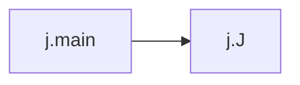

# Key Objects

[_Documentation generated by Documatic_](https://www.documatic.com)

<!---Documatic-section-j.main-start--->
## j.main

<!---Documatic-section-main-start--->


### Object Calls

* j.J

<!---Documatic-block-j.main-start--->
<details>
	<summary><code>j.main</code> code snippet</summary>

```python
def main(file, list, type, args):
    if not file:
        return
    if args and os.path.isdir(args[-1]):
        sys.stdout.write(os.path.realpath(args[-1]))
        return
    j = J(file)
    if not j.matches(args):
        j.matches(args, True)
    if list or not args:
        sys.stderr.write(j.pretty(type) + '\n')
        if j.common:
            sys.stderr.write('common: %s\n' % j.common)
    elif j.common:
        sys.stdout.write(j.common)
    else:
        go = j.go(type)
        if not go:
            return
        sys.stdout.write(go)
```
</details>
<!---Documatic-block-j.main-end--->
<!---Documatic-section-main-end--->

# #
<!---Documatic-section-j.main-end--->

[_Documentation generated by Documatic_](https://www.documatic.com)